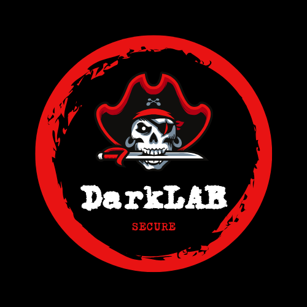

# Secure DarkLAB - secure darknet investigation laboratory

##
**"Secure DarkLAB" is a project designed as a secure laboratory dedicated to the exploration, investigation, and research on the darknet.**

The main objective is to provide a secure and isolated environment enabling researchers, professionals, and students to:

  - Understand the dynamics and functioning of the darknet.
  - Simulate scenarios of digital investigations and analyze malicious activities.
  - Test advanced analytical tools in a safe and isolated setting.

Secure DarkLAB is built on a secure infrastructure that includes:

  - Proxmox/XCP-ng: A dedicated and isolated hypervisor.
  - OPNsense: A firewall to isolate and segment the network, ensuring a secure testing environment.
  - Whonix Gateway and Workstation: To ensure protected access to the Tor network for investigation and anonymous browsing.
  - Security Onion: An advanced intrusion detection and prevention solution (IDS/IPS) and log collection system for analyzing network activities.
  - Kali Linux: Penetration testing tools to simulate attack and defense scenarios.

Use Cases:

  - Research on illegal marketplaces: Controlled exploration of darknet marketplaces to study their mechanisms.
  - Analysis of anonymous communications: Studying protocols and network flows using Security Onion to capture and decode traffic.
  - Cybersecurity training: Simulating scenarios to learn how to identify and counter malicious activities.
  - Advanced digital investigations: Developing and testing investigation techniques in anonymized environments and searching for leaks.
